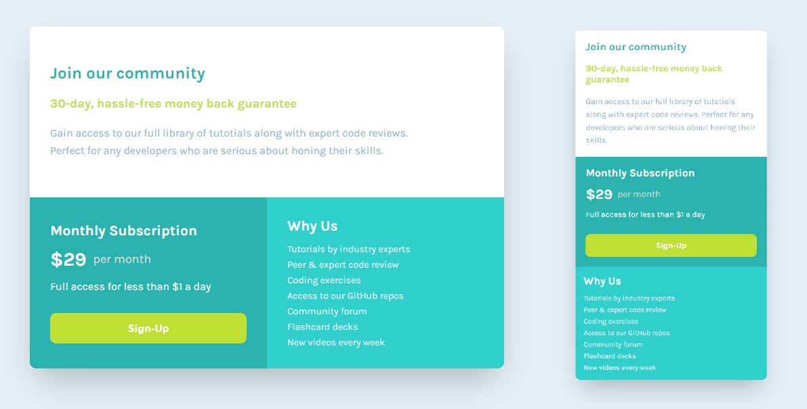

# Frontend Mentor - Single price grid component

This is my solution to the [Single price grid component challenge on Frontend Mentor](https://www.frontendmentor.io/challenges/single-price-grid-component-5ce41129d0ff452fec5abbbc)

## The challenge

Users should be able to:

- View the optimal layout for the component depending on their device's screen size
- See a hover state on desktop for the Sign Up call-to-action

## Links

- [Solution URL](https://www.frontendmentor.io/challenges/manage-landing-page-SLXqC6P5)
- [Live Site URL](https://jhon-okayda-manage-landing-page.netlify.app/)

## Built with

- React JS
- SCSS
- BEM

## Author

- Created by - okayda-jhon
